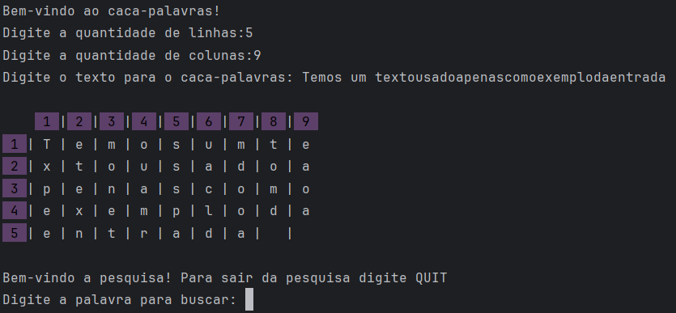

<h1>Caça-palavras</h1>

Este projeto foi desenvolvido durante a disciplina de Laboratório de Programação II do curso de Sistemas de Informação na UFSM, sob a supervisão da professora Deise Saccol.

O programa roda no terminal e funciona de forma similar a um caça-palavras.

Basicamente, o usuário entra com o tamanho da grade e um texto, que é transformado em um caça-palavras.

Em seguida, o usuário pode pesquisar palavras no caça-palavras, e o programa o informará se a palavra existe ou não na matriz de caracteres.

